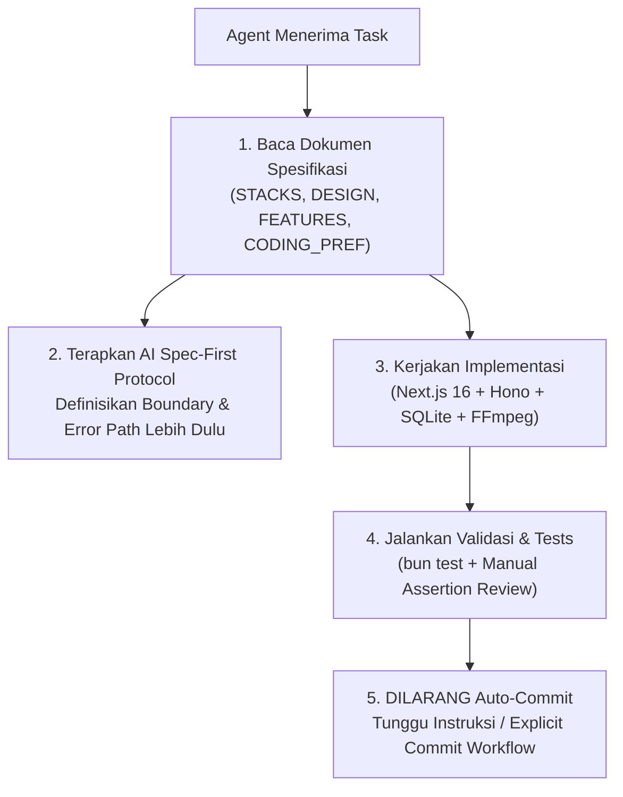

# AGENTS.md — xClips Agent Operating Protocol & Master Guide

Welcome to **xClips** (Smart Video Clipper & Short-Form Studio). Dokumen ini adalah **Master Directive** untuk setiap AI Agent yang bekerja di codebase ini. Agent **WAJIB** membaca dan mematuhi seluruh protokol, aturan workflow, serta panduan arsitektur yang tertera di bawah ini.

---

## 🧭 Master Knowledge Index (Wajib Dibaca)

Sebelum melakukan perubahan kode, debugging, penambahan fitur, atau refactoring, **AGENT WAJIB MEMBACA DOKUMEN PENDUKUNG TERKAIT** berikut:

| Dokumen | Lokasi | Deskripsi & Fokus Pembahasan |
| :--- | :--- | :--- |
| **Tech Stack** | [`STACKS.md`](file:///d:/@dev/xclips/STACKS.md) | Detail lengkap runtime, framework, libraries, database, media engine, dan dependencies. |
| **Design System** | [`DESIGN.md`](file:///d:/@dev/xclips/DESIGN.md) | Desain visual, Masagi Zinc Dark palette, komponen MUI v9, dual-pane studio layout, dan subtitle styling. |
| **Feature Catalog** | [`FEATURES.md`](file:///d:/@dev/xclips/FEATURES.md) | Spesifikasi fungsional 7 modul utama (Ingestion, VFR, AI Map-Reduce, Filler Removal, Framing, Batch Render, Vault). |
| **Coding Preferences** | [`CODING_PREF.md`](file:///d:/@dev/xclips/CODING_PREF.md) | Standar penulisan TypeScript, arsitektur layer, struktur error handling, Pino logging, dan konvensi penamaan. |
| **Product Requirements** | [`docs/PRD-xclips.md`](file:///d:/@dev/xclips/docs/PRD-xclips.md) | Product Requirement Document (PRD) konsensus v1.1.0 untuk latar belakang bisnis dan spesifikasi produk. |

---

## 🛡️ Core Agent Protocols & Guardrails



### 1. Zero Auto-Commit Protocol (Strict)
> [!IMPORTANT]
> **AI AGENTS DILARANG KERAS MELAKUKAN `git commit` SECARA OTOMATIS.**
> - Semua perubahan harus dibiarkan berada di working directory / staging.
> - Commit hanya boleh dilakukan jika user memberikan perintah eksplisit (contoh: *"commit sekarang"*, `/explicit-commit`).
> - Ikuti workflow di [`.agents/workflows/explicit-commit.md`](file:///d:/@dev/xclips/.agents/workflows/explicit-commit.md).

### 2. AI Spec-First & Test Integrity Audit
> [!WARNING]
> **HINDARI AI TEST MIRRORING ANTI-PATTERN.**
> - Jangan minta atau membuat unit test *setelah* implementasi dibuat tanpa spesifikasi independen (AI cenderung mirroring bug menjadi expected behavior).
> - Selalu audit assertion secara manual, terutama pada **Error Paths** dan **Boundary Conditions** (`0`, `-1`, empty array `[]`, `null`, `undefined`, `NaN`).
> - Jangan mengejar persentase coverage kosong. Utamakan ketajaman verifikasi invariant.
> - Ikuti workflow di [`.agents/workflows/ai-spec-first-audit.md`](file:///d:/@dev/xclips/.agents/workflows/ai-spec-first-audit.md).

### 3. Local-First & Zero-Drift Media Pipeline
> [!CAUTION]
> Pemrosesan media berat (video trimming, framing, encoding) dilakukan **100% lokal** via native binaries (`ffmpeg`, `ffprobe`, `yt-dlp`).
> - Data video **TIDAK PERNAH** diunggah ke cloud AI. Hanya transkrip / audio chunk ringan yang dikirim ke endpoint AI Gemini Flash.
> - Selalu gunakan SQLite WAL mode di `vault/xclips/xclips.db`.
> - Kredensial AI disimpan di `vault/xclips/settings.json`, bukan plain-text hardcoded.

---

## ⚡ Dev Environment & CLI Tooling Tips

### Quick Execution Commands
```bash
# 1. Install dependencies
bun install

# 2. Run Web UI (Next.js 16 App Router on Port 3350)
bun run dev

# 3. Run Hono API Backend (Port 3351)
bun run start:api
# Atau dengan auto-reload watcher:
bun run dev:api

# 4. Run Both UI & API Concurrently
bun run dev:all

# 5. Run Test Suite (Bun native test runner)
bun test

# 6. Production Static Build & Tauri Desktop Shell
bun run build       # Next.js static export -> out/
bun run tauri:dev   # Launch Tauri v2 desktop window
```

### Port Mapping & Services
| Service | Port | Endpoint URL / Path | Keterangan |
| :--- | :--- | :--- | :--- |
| **Next.js Web UI** | `3350` | `http://localhost:3350` | Frontend React 19 + MUI v9 |
| **Hono API Server** | `3351` | `http://localhost:3351/api/xclips/*` | 32 API routes untuk media & project |
| **SQLite Database** | N/A | `vault/xclips/xclips.db` | SQLite WAL mode via `bun:sqlite` |
| **Settings Vault** | N/A | `vault/xclips/settings.json` | API Keys & preferences |

---

## 🧪 Testing & Verification Instructions

1. **Jalankan Unit Test**:
   ```bash
   bun test
   ```
2. **Menjalankan Test Tertentu**:
   ```bash
   bun test tests/xclips/ffmpeg-builder.test.ts
   bun test tests/xclips/filler-detector.test.ts
   bun test tests/xclips/xclips-db.test.ts
   bun test tests/xclips/transcript-chunker.test.ts
   bun test tests/xclips/ytdlp-downloader.test.ts
   ```
3. **Type Checking**:
   Pastikan tidak ada TypeScript errors sebelum menyelesaikan tugas:
   ```bash
   bun x tsc --noEmit
   ```
4. **Log Inspection**:
   Periksa log terstruktur di folder `logs/`:
   - `logs/app.log` (Semua level debug/info dengan `X-Trace-Id`)
   - `logs/error.log` (Khusus error)

---

## 📝 Pull Request & Conventional Commit Rules

Ketika user menginstruksikan commit (`/explicit-commit`), gunakan format **Conventional Commits**:

```text
type(scope): concise description in imperative mood

- Detailed bullet point 1
- Detailed bullet point 2
```

### Allowed Scopes
- `ui` — Next.js pages, MUI components, canvas, waveform, styling
- `api` — Hono route handlers (`src/server/index.ts`)
- `media` — FFmpeg builder, VFR probe, yt-dlp downloader
- `db` — SQLite schema, queries, migrations (`src/lib/xclips/xclips-db.ts`)
- `ai` — Transcript chunking, Gemini scoring, word timestamps
- `tauri` — Rust core, desktop shell config
- `docs` — Dokumentasi dan workflow updates

---

*xClips AGENTS Master Guide v1.0.0 — Updated 2026-08-29*
