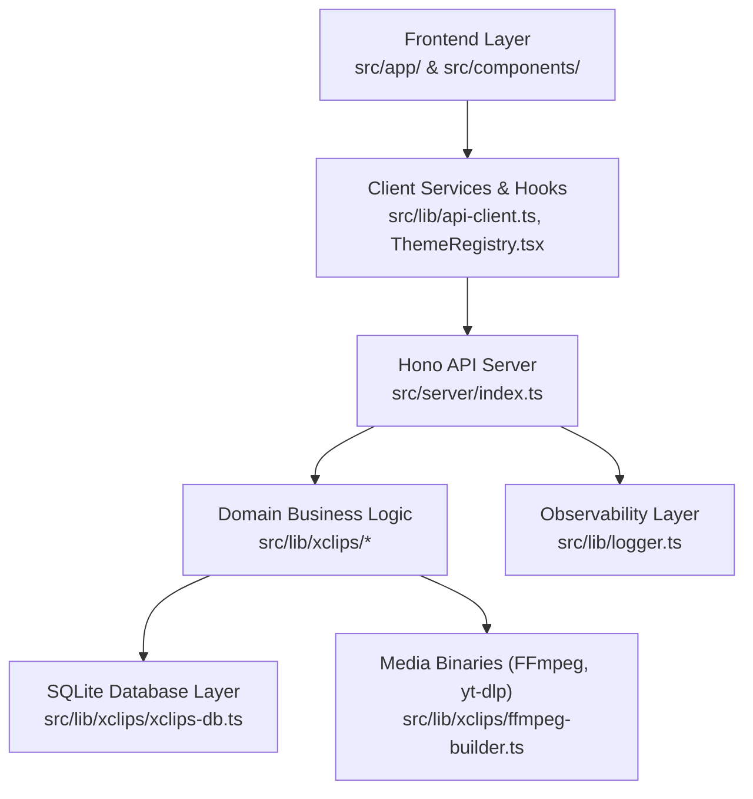

# CODING_PREF.md — xClips Coding Standards & Preferences

Dokumen ini memuat standar penulisan kode (*coding conventions*), arsitektur layer, pola error handling, observabilitas, dan pedoman testing yang berlaku di seluruh codebase **xClips**.

---

## 🏛️ Codebase Organization & Layering



### Struktur Folder Utama
```text
xclips/
├── src/
│   ├── app/                 # Next.js 16 App Router (pages & layouts)
│   │   ├── layout.tsx       # Root layout dengan ThemeRegistry
│   │   └── xclips/
│   │       ├── page.tsx     # Project dashboard / manager
│   │       └── studio/      # Dual-Pane Video Studio workspace
│   ├── components/          # Reusable UI components
│   │   ├── form/            # Form inputs & controls
│   │   └── layout/          # Sidebar, header, dialog wrappers
│   ├── lib/                 # Shared utilities, env, theme, logger
│   │   ├── xclips/          # Core Domain Logic:
│   │   │   ├── types.ts              # TypeScript interfaces & types
│   │   │   ├── xclips-db.ts          # SQLite database repository
│   │   │   ├── ffmpeg-builder.ts     # GPU & Filter command builder
│   │   │   ├── filler-detector.ts    # Indonesian token filler matcher
│   │   │   ├── transcript-chunker.ts # Map-Reduce chunking logic
│   │   │   ├── vfr-probe.ts          # ffprobe VFR detection
│   │   │   ├── ytdlp-downloader.ts   # yt-dlp downloader sidecar
│   │   │   └── queue.ts              # Batch render job queue
│   │   ├── env.ts           # Zod environment configuration
│   │   ├── logger.ts        # Pino scoped loggers & traceId
│   │   ├── theme.ts         # Material UI v9 theme definition
│   │   └── api-client.ts    # Frontend HTTP fetch wrapper
│   └── server/
│       └── index.ts         # Hono API Server (32 endpoints on :3351)
├── tests/                   # Bun test suites
│   ├── logger.test.ts
│   └── xclips/              # Domain unit tests
├── vault/                   # Local SQLite DB, settings.json, cache
└── .agents/workflows/       # Agent execution workflows
```

---

## 🎯 TypeScript & Language Standards

1. **Strict Type Safety**:
   - `tsconfig.json` dikonfigurasi dengan mode ketat (`"strict": true`).
   - **Dilarang keras** menggunakan `any` tanpa alasan mendesak. Jika tipe data bersifat dinamis, gunakan `unknown` dan validasi menggunakan `zod` atau *type guards*.
2. **Schema & Runtime Validation**:
   - Gunakan `zod` untuk memvalidasi request body pada endpoint Hono dan form input pada frontend.
3. **Immutability & Math Precision**:
   - Perhitungan durasi, framerate, atau offset audio/video wajib menggunakan pustaka `decimal.js` atau pembulatan presisi milidetik yang konsisten untuk mencegah akumulasi kesalahan floating-point.

---

## 🛡️ Error Handling & API Response Format

Semua endpoint Hono pada `src/server/index.ts` **WAJIB** mengembalikan format JSON yang konsisten:

### Standard Success Response
```typescript
return c.json({
  success: true,
  data: {
    projectId: "proj_123",
    status: "ready"
  },
  traceId: c.get("traceId"),
}, 200);
```

### Standard Error Response
```typescript
return c.json({
  success: false,
  error: "Project not found or invalid ID",
  code: "PROJECT_NOT_FOUND",
  traceId: c.get("traceId"),
}, 404);
```

### HTTP Status Code Guidelines
- `200 OK` — Permintaan berhasil diproses.
- `201 Created` — Resource baru berhasil dibuat di database.
- `400 Bad Request` — Parameter atau query tidak valid / hilang.
- `404 Not Found` — File video, project ID, atau clip ID tidak ditemukan.
- `422 Unprocessable Entity` — Schema Zod gagal validasi.
- `500 Internal Server Error` — FFmpeg crash, OS error, atau database disk error.

---

## 📊 Logging & Observability Standards

> [!IMPORTANT]
> **DILARANG MENGGUNAKAN `console.log` DI PRODUCTION CODE.**
> Selalu gunakan **Scoped Pino Logger** dari `src/lib/logger.ts`.

### Penggunaan Scoped Logger
```typescript
import { ffmpegLogger, dbLogger, httpLogger } from "@/lib/logger";

// 1. Log dengan context object & traceId
ffmpegLogger.info(
  { traceId, projectId, gpuMode: "nvenc", command: cmdStr },
  "Starting hardware-accelerated video render"
);

// 2. Log error dengan error object serializer
try {
  // operasional ffmpeg
} catch (err: unknown) {
  const errorObj = err instanceof Error ? err : new Error(String(err));
  ffmpegLogger.error(
    { traceId, projectId, err: errorObj },
    "FFmpeg render failed during CFR remux"
  );
}
```

---

## 🗄️ Database Access Conventions (`bun:sqlite`)

1. **Prepared Statements**:
   - Selalu gunakan prepared statements untuk mencegah SQL Injection dan meningkatkan kecepatan eksekusi:
     ```typescript
     const stmt = db.prepare("SELECT * FROM projects WHERE id = ?");
     const project = stmt.get(projectId);
     ```
2. **Transaction Safety**:
   - Operasi multi-tabel (misalnya menyimpan transkrip ribuan kata bersama metadata klip) wajib dibungkus dalam transaksi `db.transaction(...)`.
3. **WAL Mode Active**:
   - Database diinisiasi dengan `PRAGMA journal_mode = WAL;` dan `PRAGMA synchronous = NORMAL;`.

---

## 🧪 Testing & Assertion Guidelines

Mengikuti protokol di [`.agents/workflows/ai-spec-first-audit.md`](file:///d:/@dev/xclips/.agents/workflows/ai-spec-first-audit.md):

```typescript
import { describe, expect, it } from "bun:test";
import { detectFillers } from "@/lib/xclips/filler-detector";

describe("detectFillers()", () => {
  // 1. Boundary: Empty words array
  it("should return empty array when transcript is empty []", () => {
    const result = detectFillers([]);
    expect(result).toHaveLength(0);
  });

  // 2. Negative Test: Substring false-positive prevention
  it("should NOT flag 'harga' or 'tahu' as filler words", () => {
    const words = [
      { word: "harga", start: 0.1, end: 0.4, confidence: 0.99 },
      { word: "tahu", start: 0.5, end: 0.8, confidence: 0.98 },
    ];
    const result = detectFillers(words);
    expect(result).toHaveLength(0);
  });

  // 3. Positive Test: Token-level filler match
  it("should accurately detect Indonesian filler tokens 'ee' and 'apa namanya'", () => {
    const words = [
      { word: "ee", start: 1.0, end: 1.4, confidence: 0.95 },
      { word: "apa", start: 2.0, end: 2.3, confidence: 0.92 },
      { word: "namanya", start: 2.31, end: 2.7, confidence: 0.94 },
    ];
    const result = detectFillers(words);
    expect(result.length).toBeGreaterThanOrEqual(1);
    expect(result[0].token).toBe("ee");
  });
});
```

---

## 📌 Summary Checklist for Every Code Change

- [ ] Kode ditulis dalam TypeScript dengan type safety yang jelas (tidak ada `any` yang tidak perlu).
- [ ] Schema request/input divalidasi dengan `zod`.
- [ ] Log menggunakan scoped Pino logger (`mediaLogger`, `httpLogger`, dll) dengan `traceId`.
- [ ] Boundary condition dan error paths memiliki unit test yang memadai di `tests/`.
- [ ] Jalankan `bun test` dan pastikan seluruh test suite lolos (*green*).
- [ ] Jangan auto-commit; tunggu instruksi user untuk `/explicit-commit`.

---

*xClips Coding Preferences Reference v1.0.0 — Updated 2026-08-29*
