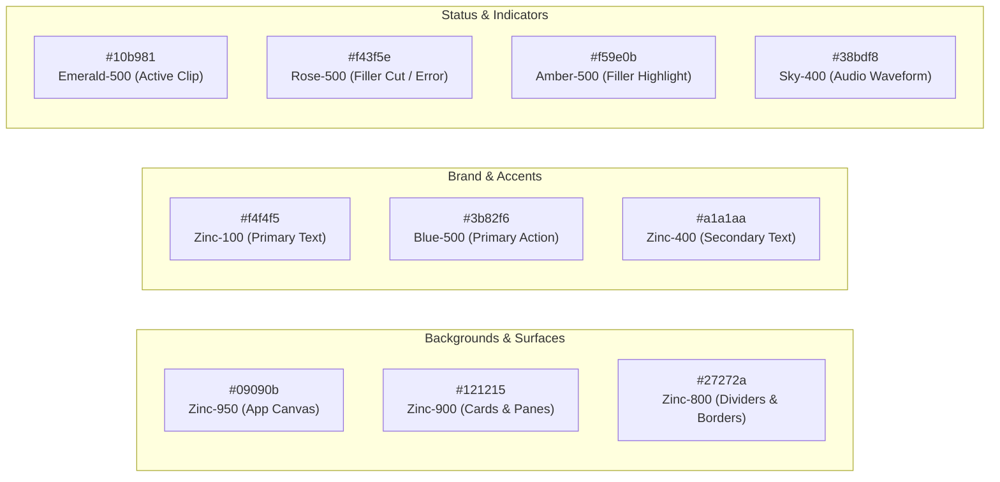
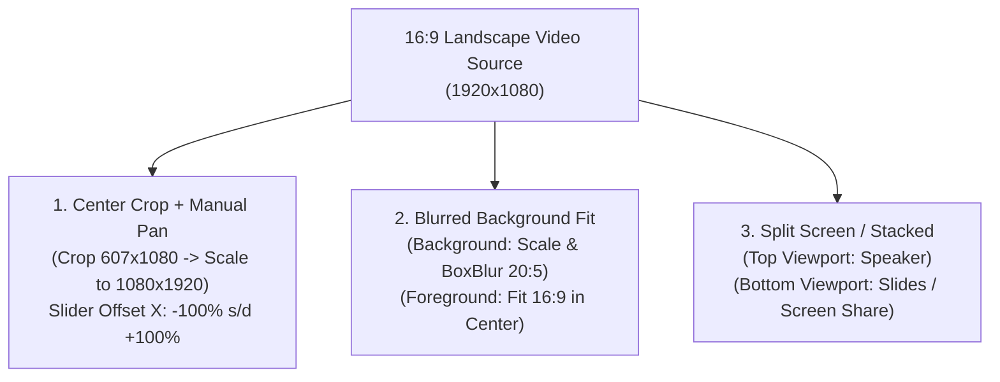

# DESIGN.md — xClips Design System & UI/UX Architecture

Dokumen ini mendefinisikan pedoman desain visual, palet warna, tipografi, tata letak antarmuka (*Dual-Pane Studio*), dan standar komponen antarmuka untuk **xClips**.

---

## 🎨 Design Philosophy: *Masagi Dark Precision*

Antarmuka **xClips** dirancang dengan filosofi **Pro-Grade Studio Workstation**:
1. **Dark-First Immersion**: Latar belakang hitam pekat (*Zinc-950*) mengurangi kelelahan mata saat mengedit video berjam-jam dan menonjolkan warna video 9:16.
2. **High Information Density with High Scannability**: Tata letak dual-pane memungkinkan editor melihat pratinjau video, transkrip kata, waveform audio, dan antrean render secara bersamaan tanpa berpindah halaman.
3. **Micro-Feedback & Precision**: Setiap aksi (pemotongan filler, geser crop pan, scrubbing audio) memberikan respons visual instan dengan warna status yang jelas.

---

## 🌈 Color Palette & Design Tokens

Diimplementasikan dalam `src/lib/theme.ts` menggunakan Material UI v9:



### Palet Token Lengkap
| Token | Hex Code | Role & Usage |
| :--- | :--- | :--- |
| `background.default` | `#09090b` | Base canvas background seluruh desktop window |
| `background.paper` | `#121215` | Studio panels, cards, modal dialogs, drawers |
| `divider` | `#27272a` | Border pemisah panel, batas list item |
| `text.primary` | `#f4f4f5` | Judul, label aktif, transkrip kata utama |
| `text.secondary` | `#a1a1aa` | Metadata timestamp, label pendukung, tips |
| `primary.main` | `#f4f4f5` | Kontras tombol aksi utama |
| `secondary.main` | `#3b82f6` | Slider accents, active tab indicator, selected clip highlight |
| `warning.main` | `#f59e0b` | Deteksi kata jeda (*filler words*), indikator VFR |
| `error.main` | `#f43f5e` | Kata yang dicut / dihapus, error log, cancel button |
| `success.main` | `#10b981` | Render complete, GPU active badge, viral score $\ge 90$ |

---

## 📐 Dual-Pane Studio UI Architecture

Tata letak studio desktop utama menggunakan arsitektur **Dual-Pane Grid**:

```
+===================================================================================================+
| [xclips v1.0]   Project: Podcast_Eps12.mp4   [+ Ingest]   [GPU: NVENC Active]   [Settings]        |
+===================================================================================================+
| LEFT PANE: 9:16 PREVIEW & TIMELINE               | RIGHT PANE: TABBED INSPECTOR                    |
|                                                  | [AI Clips (6)] [Transcript] [Styler] [Export]   |
|  +--------------------------------------------+  +-----------------------------------------------+
|  | [Mode: 9:16 Blur v] [Zoom: 100%] [Pan: 0%] |  | AI DISCOVERED CLIPS                           |
|  |                                            |  | --------------------------------------------- |
|  |           9:16 LIVE PREVIEW CANVAS         |  | [★ 96] "Mindset Risk/Reward 1:3" (00:48) [EDIT]|
|  |                                            |  | Hook: "Kenapa akun pemula rontok di pekan 1?" |
|  |     +--------------------------------+     |  | Tags: #Trading #RiskManagement               |
|  |     |   HOOK: JANGAN ENTRY SEMBARANG |     |  | --------------------------------------------- |
|  |     |                                |     |  | [★ 89] "Solusi Drawdown Psikologis"   (01:05) |
|  |     |        [ VIDEO VIEWPORT ]      |     |  | Hook: "Trik cut loss tanpa rasa bersalah"     |
|  |     |                                |     |  +-----------------------------------------------+
|  |     |   [ KARAOKE SUBTITLE ACTIVE ]  |     | INTERACTIVE TRANSCRIPT & FILLER TOGGLE          |
|  |     +--------------------------------+     |  "Sebenarnya [ee 0.4s] aturan mainnya sangat     |
|  |                                            |   sederhana: jangan pernah [overlot 0.6s]..."    |
|  |   [⏮] [◀] [Play / Pause] [▶] [⏭]           |  [x] Auto-cut 8 Fillers (saved 4.2s)             |
|  |   Current Time: 00:14.320 / 00:48.000      |  [x] Auto-cut 3 Silences (saved 3.1s)            |
|  +--------------------------------------------+  +-----------------------------------------------+
|  | WAVEFORM & SEGMENT TIMELINE:               |  | SUBTITLE & FRAMING INSPECTOR                  |
|  | [||||||||||||||||||||||||||||||||||||||||] |  | Subtitle Preset: [ Hormozi Bold (Yellow)   v]  |
|  | [Start: 00:00.00]  [✂ Cut Filler]  [End]   |  | Framing Mode:   ( ) Center  (•) Blur  ( ) Split|
|  +--------------------------------------------+  | [x] Auto-Emoji   [x] ALL-CAPS Text            |
+===================================================================================================+
| Render Queue: 2 Active | 1 Queued            [Hardware: NVIDIA RTX 4060]     [ EXPORT CLIPS (3) ] |
+===================================================================================================+
```

---

## 🎬 Video Framing & Aspect Ratio Modes

Transformasi dari sumber 16:9 Landscape ke 9:16 Portrait Vertikal:



---

## 🎤 Dynamic Subtitle Styling System

Sistem subtitle dinamis terintegrasi dengan *word-level timestamping*:

| Preset Name | Visual Style | Active Word Highlight | Font & Shadow |
| :--- | :--- | :--- | :--- |
| **Hormozi Neon Bold** | Huruf kapital tebal (*ALL-CAPS*) di tengah bawah | Warna kuning neon (`#FACC15`) atau hijau neon (`#22C55E`) | Montserrat ExtraBold, Drop Shadow hitam tebal (stroke 4px) |
| **Clean Box Modern** | Box latar belakang semi-transparan per baris (`rgba(0,0,0,0.7)`) | Warna putih menyala dengan underline lembut | Inter / Roboto Bold, Rounded corner box |
| **Minimalist Sub** | Teks subtitle tanpa latar belakang, bersih | Teks putih murni dengan subtle blur shadow | Inter Medium, ukuran proporsional |

### Auto-Emoji System
Sistem secara otomatis mendeteksi kata-kata kunci emosional/topikal dan menyisipkan emoji di atas subtitle:
- **Profit / Uang / Bisnis**: 💰, 📈, 🚀, 💵
- **Peringatan / Bahaya**: ⚠️, ❌, 🛑, 💣
- **Ide / Tips / Trik**: 💡, 🧠, 🎯, 🔥

---

## 🕹️ Component Guidelines & Interaction Rules

1. **Buttons & Controls**:
   - `borderRadius: 8px` seragam di seluruh aplikasi.
   - `textTransform: 'none'` (dilarang menggunakan huruf kapital default Material UI).
   - Efek hover subtle: tidak menggunakan drop shadow tebal yang mengganggu, gunakan background tint.
2. **Cards & Panels**:
   - Border eksplisit `1px solid #27272a`.
   - `backgroundImage: 'none'` untuk menjaga kemurnian warna flat dark.
3. **Transcript Word Interaction**:
   - Klik kata pada transkrip $\rightarrow$ video & audio waveform langsung loncat (*seek*) ke timestamp kata tersebut.
   - Kata bertipe filler ditandai dengan badge Amber (`#f59e0b`), dan jika dicut dicoret dengan Rose (`#f43f5e`).
4. **Waveform Canvas**:
   - Render menggunakan Wavesurfer.js dengan warna gelombang Sky Blue (`#38bdf8`) dan progress bar White (`#f4f4f5`).

---

*xClips Design System Reference v1.0.0 — Updated 2026-08-29*
