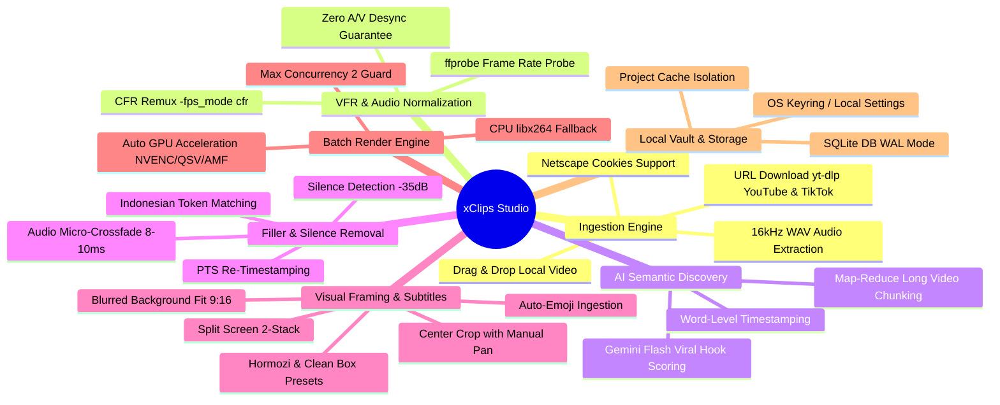

# FEATURES.md — xClips Functional Catalog & Feature Specifications

Dokumen ini memuat katalog lengkap fitur, alur kerja teknis (*pipeline*), dan spesifikasi implementasi fungsional dalam **xClips**.

---

## 🗺️ Functional Feature Map



---

## 🎯 7 Core Feature Modules

### 1. Media Ingestion Engine
- **Local File Import**:
  - Format didukung: `.mp4`, `.mov`, `.mkv`, `.webm`, `.avi`, `.wav`, `.mp3`.
  - File disalin/direferensikan ke dalam workspace proyek lokal tanpa merusak file asli.
- **Direct URL Ingest (yt-dlp)**:
  - Download langsung dari YouTube (Video/Shorts/Livestream VOD) dan TikTok via native `yt-dlp` binary.
  - Mendukung cookie Netscape (`cookies.txt`) untuk video private, anggota channel, atau berbatas umur.
- **Audio Extraction Pipeline**:
  - Ekstraksi audio mono 16kHz WAV ringan ke `vault/xclips/cache/audio/{project_id}.wav` untuk mempercepat pemrosesan transkrip AI.

---

### 2. VFR (Variable Frame Rate) Detection & CFR Normalization
- **Latar Belakang Masalah**: Rekaman video dari smartphone (iPhone/Android) atau software screen recorder (OBS) sering kali menggunakan *Variable Frame Rate (VFR)* yang menyebabkan audio dan video desinkronisasi saat dipotong.
- **Logika Deteksi**:
  - `ffprobe` membandingkan nilai `r_frame_rate` dan `avg_frame_rate`.
  - Jika terjadi selisih atau flag VFR terdeteksi, status proyek ditandai sebagai `vfr_detected: true`.
- **CFR Remux Otomatis**:
  - Sistem mengeksekusi remuxing cepat berbasis Constant Frame Rate (`-fps_mode cfr` / `-vsync cfr`) sehingga seluruh proses pemotongan frame memiliki akurasi frame mutlak (*exact frame alignment*).

---

### 3. Scalable AI Transcription & Semantic Discovery (Map-Reduce)
- **Map-Reduce Chunking untuk Video Panjang**:
  - Video berdurasi panjang (> 15 menit) dipecah menjadi chunk audio **15 menit dengan overlap 30 detik**.
  - Setiap chunk dikirim secara terstruktur ke AI Provider (Gemini Flash).
  - Backend melakukan *Reduce*: menggabungkan hasil transkrip, menyesuaikan offset waktu absolut, dan meranking top 5-10 momen klip terbaik secara global.
- **Word-Level Timestamping**:
  - Transkrip disimpan dengan timestamp presisi per kata (`word`, `start`, `end`, `confidence`).
- **Viral Hook Scoring (0-100)**:
  - AI menganalisis hook kalimat pembuka, nilai emosi, dan kepadatan informasi untuk memberikan skor viralitas dan judul hook yang siap pakai.

---

### 4. Indonesian Filler & Silence Removal Engine
- **Token-Level Matching**:
  - Deteksi kata jeda dilakukan pada level token kata individual, **bukan** regex string kasar (mencegah salah potong kata seperti *"harga"* yang mengandung *"ha"*).
  - **Daftar Token Kata Jeda**: `e`, `ee`, `eee`, `hm`, `hmm`, `eh`, `ha`, `begitu ya ya`, `gitu ya ya`, `ya kan gitu`, `jadi gitu`, `apa namanya`, `katakanlah`.
- **Silence Detection**:
  - Deteksi hening dengan ambang `-35 dB` dan durasi $\ge 1.0$ detik menggunakan filter `silencedetect` FFmpeg.
- **Audio Micro-Crossfade (8-10ms)**:
  - Sambungan potongan audio dihaluskan dengan filter `acrossfade=d=0.01:c1=tri:c2=tri` untuk menghilangkan artefak suara *pop/klik*.
- **PTS Resetting**:
  - Reset timestamp video dan audio (`setpts=PTS-STARTPTS`, `asetpts=PTS-STARTPTS`) sebelum penggabungan segmen (*concat*).

---

### 5. Video Framing & Subtitle Styler
- **Framing Modes (9:16 Portrait)**:
  1. **Center Crop with Manual Pan**: Crop tengah 9:16 dengan slider penyesuaian sumbu X (-100% s/d +100%) untuk membingkai posisi wajah pembicara.
  2. **Blurred Background Fit**: Video asli 16:9 diletakkan di tengah dengan latar belakang salinan video yang di-scale dan di-blur (`boxblur=20:5`).
  3. **Split Screen (2-Stack)**: Menumpuk dua viewport video secara vertikal (contoh: video pembicara di atas, rekaman layar/gameplay di bawah).
- **Karaoke Subtitle Presets**:
  - **Hormozi Neon Bold**: Teks tebal di tengah bawah, kata yang sedang diucapkan menyala kuning/hijau neon (`#FACC15`).
  - **Clean Box**: Subtitle dengan latar belakang kotak semi-transparan yang rapi.
  - **Auto-Emoji**: Injeksi otomatis ikon emoji ekspresif pada kata kunci penting.

---

### 6. Batch Render Queue & Hardware Acceleration
- **Concurrency Guard**:
  - Dibatasi `max_concurrent_jobs: 2` untuk menjaga stabilitas memori RAM dan mencegah crash OS saat merender banyak klip sekaligus.
- **Auto-Detect GPU Pipeline**:
  ```mermaid
  graph TD
      Detect["Deteksi GPU FFmpeg"] --> NVENC{"NVIDIA NVENC Tersedia?"}
      NVENC -- Ya --> UseNVENC["Gunakan h264_nvenc (Prioritas 1)"]
      NVENC -- Tidak --> QSV{"Intel QuickSync Tersedia?"}
      QSV -- Ya --> UseQSV["Gunakan h264_qsv (Prioritas 2)"]
      QSV -- Tidak --> AMF{"AMD AMF Tersedia?"}
      AMF -- Ya --> UseAMF["Gunakan h264_amf (Prioritas 3)"]
      AMF -- Tidak --> CPU["Fallback ke CPU libx264 -preset veryfast"]
  ```

---

### 7. Local Vault & Storage Isolation
- **SQLite Database**: `vault/xclips/xclips.db` dengan mode WAL (*Write-Ahead Logging*).
- **Media Cache Management**: Penyimpanan sementara audio `.wav` dan video proxy di `vault/xclips/cache/`.
- **Cache Clean-Up**: Menu pembersihan cache di Settings untuk menghemat kapasitas disk pengguna setelah proyek selesai diexport.

---

## 📊 Feature Status & Test Coverage

| Modul Fitur | Status Implementasi | Unit Test Terkait |
| :--- | :---: | :--- |
| **Media Ingestion (Local + yt-dlp)** | ✅ Production | `tests/xclips/ytdlp-downloader.test.ts` |
| **VFR Probe & Normalization** | ✅ Production | `tests/xclips/ffmpeg-builder.test.ts` |
| **AI Transcript Map-Reduce** | ✅ Production | `tests/xclips/transcript-chunker.test.ts` |
| **Indonesian Filler Detector** | ✅ Production | `tests/xclips/filler-detector.test.ts` |
| **SQLite Projects & Clips DB** | ✅ Production | `tests/xclips/xclips-db.test.ts` |
| **FFmpeg GPU Command Builder** | ✅ Production | `tests/xclips/ffmpeg-builder.test.ts` |
| **Pino Observability & Tracing** | ✅ Production | `tests/logger.test.ts` |
| **Studio UI & Waveform Canvas** | ✅ Production | E2E / Manual Verification |

---

*xClips Features Catalog v1.0.0 — Updated 2026-08-29*
