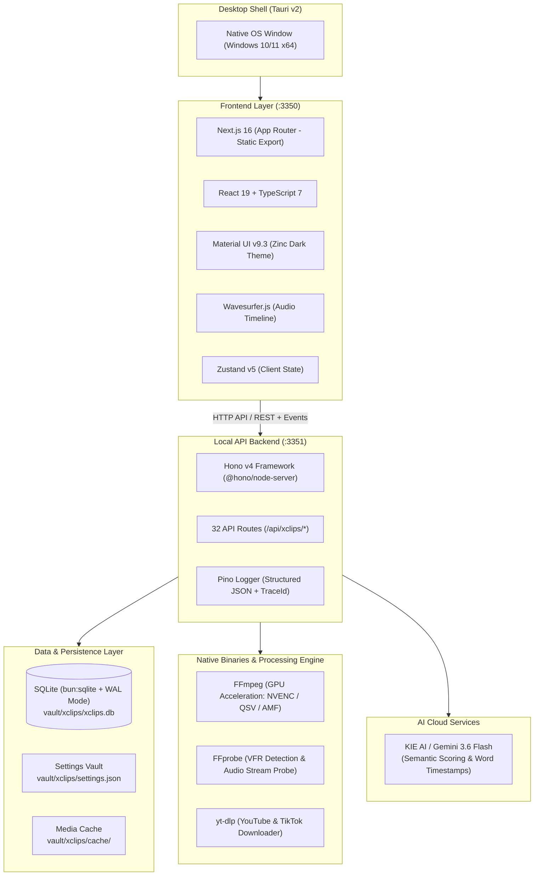

# STACKS.md — xClips Technical Stack & Architecture

Dokumen ini mendefinisikan seluruh lapisan teknologi, pustaka (*libraries*), dependensi eksternal, dan arsitektur runtime yang digunakan dalam **xClips**.

---

## 🏛️ System Topology & Architectural Overview



---

## 📦 Detailed Stack Breakdown

### 1. Runtime & Environment
- **Runtime**: **Bun (v1.2+)**
  - Digunakan sebagai JavaScript/TypeScript runtime utama, test runner (`bun test`), dan package manager.
  - Native SQLite driver via `bun:sqlite` untuk performa query lokal berkecepatan tinggi.
- **Languages**:
  - **TypeScript 7.0.2** (Strict typing, zero unchecked assumptions).
  - **Rust (Tauri v2 Core)** untuk native windowing dan system bindings.

---

### 2. Frontend Layer
| Component | Technology | Version | Detail & Purpose |
| :--- | :--- | :--- | :--- |
| **Framework** | Next.js (App Router) | `^16.3.3` | Menggunakan mode `output: 'export'` untuk integrasi mulus dengan Tauri v2 desktop shell. |
| **UI Library** | React | `^19.2.8` | Core UI render engine. |
| **Component Kit** | Material UI (MUI) | `^9.3.1` | Core visual layout, buttons, dialogs, drawers, icons (`@mui/icons-material`). |
| **Styling Engine** | Emotion (`@emotion/react`, `@emotion/styled`) | `^11.14.0` | Theme engine untuk MUI v9 dengan `ThemeRegistry` SSR cache bypass. |
| **Audio Visualization**| Wavesurfer.js | `^7.12.11` | Visualisasi waveform interaktif, scrubbing, zoom, dan playback sync. |
| **State Management**| Zustand | `^5.0.15` | Lightweight client state untuk active clip, transcript word cursor, timeline state. |
| **Schema Validation**| Zod | `^4.4.3` | Runtime schema validation untuk form inputs dan API responses. |
| **Math Precision** | Decimal.js | `^10.6.0` | Perhitungan timestamp audio/video presisi tinggi (mencegah floating point drift). |
| **Document Export** | Docx | `^9.7.1` | Export transkrip dan skrip klip ke format Microsoft Word. |

---

### 3. Backend API Layer
- **Framework**: **Hono v4 (`^4.13.5`)** dengan adapter `@hono/node-server`.
- **Port**: `3351` (`PORT_API`).
- **Endpoints**: 32 REST endpoints di bawah namespace `/api/xclips/*`:
  - `/api/xclips/projects` (CRUD projects)
  - `/api/xclips/ingest/local`, `/api/xclips/ingest/url` (Media ingestion)
  - `/api/xclips/transcribe`, `/api/xclips/discover` (AI highlight scoring)
  - `/api/xclips/export`, `/api/xclips/queue` (Batch render engine)
  - `/api/xclips/settings` (AI Provider keys & hardware config)

---

### 4. Database & Storage
- **Engine**: **SQLite (`bun:sqlite`)**
- **Location**: `vault/xclips/xclips.db`
- **Journal Mode**: `WAL` (Write-Ahead Logging) untuk zero-concurrency lock antara UI read dan background queue write.
- **Key Tables**:
  - `projects` — Metadata video, duration, resolution, source path.
  - `transcripts` — Word-level timestamps (`start`, `end`, `word`, `confidence`).
  - `clips` — AI discovered clips, viral score (0-100), hook titles, manual trim bounds.
  - `render_jobs` — Status antrean batch export, progress %, GPU hardware mode.

---

### 5. Media Processing Engine (Local Binaries)
- **FFmpeg & FFprobe**:
  - Auto-detection GPU hardware acceleration:
    1. NVIDIA NVENC (`h264_nvenc`)
    2. Intel QuickSync (`h264_qsv`)
    3. AMD AMF (`h264_amf`)
    4. CPU Fallback (`libx264 -preset veryfast`)
  - VFR Detection & Fast CFR Remux (`-fps_mode cfr`).
  - Audio micro-crossfade (8-10ms) untuk pemotongan jeda/filler tanpa suara pop/klik.
- **yt-dlp**:
  - Standalone sidecar downloader untuk YouTube dan TikTok.
  - Mendukung Netscape cookie injection untuk video berbatas usia/login.

---

### 6. Logging & Observability
- **Engine**: **Pino (`^10.3.1`)** + **Pino-pretty (`^13.1.3`)**
- **Log Files**:
  - `logs/app.log` (All levels, structured JSON / formatted)
  - `logs/error.log` (Error level only)
- **Scoped Child Loggers**:
  - `httpLogger` (`http:server`)
  - `mediaLogger` (`media:engine`)
  - `ffmpegLogger` (`media:ffmpeg`)
  - `ytdlpLogger` (`media:ytdlp`)
  - `queueLogger` (`queue:worker`)
  - `dbLogger` (`db:sqlite`)
  - `aiLogger` (`ai:gemini`)
- **Tracing**: Injeksi header `X-Trace-Id` pada setiap HTTP request dan job queue execution.

---

## ⚙️ Environment Variables Reference

Didefinisikan di `.env` / `.env.local` dan divalidasi via `src/lib/env.ts` (Zod):

```bash
PORT_UI=3350                       # Next.js UI Port
PORT_API=3351                      # Hono API Port
NEXT_PUBLIC_API_BASE="http://localhost:3351"
VAULT_DIR="vault"                  # Path database dan cache lokal
NODE_ENV="development"             # development | production | test
```

> [!NOTE]
> Kredensial AI Provider (Gemini API Key) **TIDAK** disimpan di `.env`, melainkan di `vault/xclips/settings.json` untuk portabilitas dan keamanan desktop.

---

*xClips Tech Stacks Reference v1.0.0 — Updated 2026-08-29*
