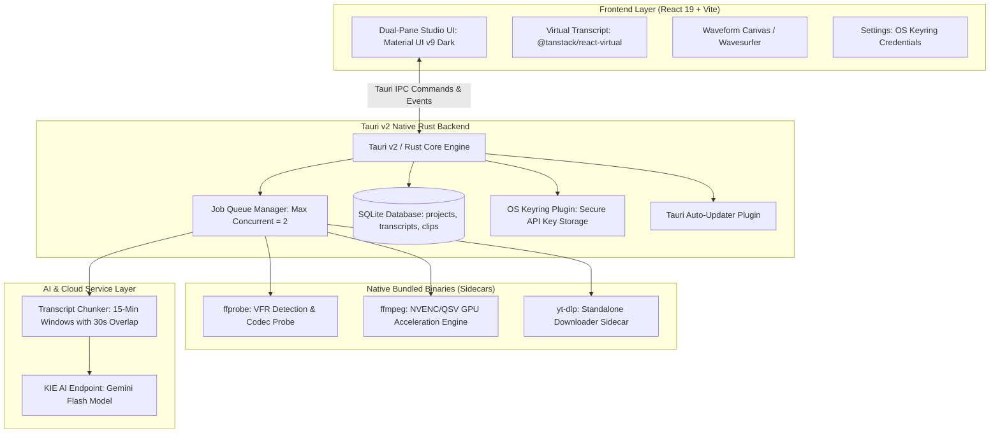

# Product Requirement Document (PRD) — xclips

**Project Name:** xclips (Smart Video Clipper & Short-Form Studio)  
**Document Version:** 1.1.0 (Production-Ready Consensus Edition)  
**Author / Co-Leader:** Masagi & efx (eggafx-labs)  
**Consensus Reviewers:** Gemini, Sonnet, Qwen  
**Target Platform:** Desktop App (Tauri v2 + Rust Core + React 19 / Vite / MUI Frontend)  
**Distribution OS:** Windows 10/11 x64 (macOS / Linux planned for v2)  
**Date:** 2026-08-26  
**Status:** APPROVED & LOCKED FOR PHASE 1 IMPLEMENTATION  

---

## 1. Executive Summary & Product Vision

**xclips** adalah aplikasi desktop berkinerja tinggi (*high-performance desktop studio*) yang dirancang untuk memotong, membersihkan, merestrukturisasi, dan mengoptimalkan video berdurasi panjang (podcast, webinar BAKOM, materi edukasi, YouTube/TikTok) menjadi konten video pendek (*short-form content* 9:16) berkualitas tinggi yang siap dipublikasikan ke TikTok, Instagram Reels, dan YouTube Shorts.

Berbeda dari aplikasi web clipping yang membebani kuota cloud dan lambat mengunggah video berukuran besar, **xclips** beroperasi secara *local-first* dengan arsitektur **Tauri v2 + Rust** yang memanfaatkan akselerasi GPU lokal (`ffmpeg` native dengan NVENC/QSV/AMF), dipadukan dengan kecerdasan cloud (*AI Semantic Highlighting & Viral Discovery*) melalui model LLM efisien (KIE AI Gemini Flash) dan *word-level timestamping*.

Workflow utama mengusung model **Hybrid**:
1. **AI Auto-Discovery**: Analisis semantik otomatis untuk merekomendasikan 5-10 klip dengan potensi viral tertinggi.
2. **Visual Studio Editor**: Ruang kendali visual untuk fine-tuning trim, toggle pembersihan filler bahasa Indonesia, kustomisasi subtitle karaoke dinamis, dan batch render.

---

## 2. Problem Statement & User Pain Points

| Pain Point | Masalah di Lapangan | Solusi xclips |
|---|---|---|
| **Editing Manual Lambat** | Menonton video 1-2 jam secara manual untuk mencari 30 detik momen emas memakan waktu berjam-jam. | AI Semantic Highlighting & Hook Scorer menemukan momen terbaik dalam <60 detik. |
| **Filler Words Bahasa Indonesia** | Penggunaan kata jeda (*"ee"*, *"hm"*, *"apa namanya"*, *"begitu ya ya"*) merusak *pacing* video pendek. | Deteksi kata jeda berbasis token kamus lokal + pemotongan otomatis non-destruktif dengan *audio micro-crossfade*. |
| **Re-framing 16:9 ke 9:16 Rumit** | Mengubah rasio aspek membutuhkan crop manual, duplikasi layer blur, atau split screen yang memakan waktu. | Preset layout 1-klik: *Center Crop with Manual Pan*, *Blurred Background Fit*, dan *Split-Screen Stacked*. |
| **Subtitle Karaoke Mahal / Rumit** | Tool animasi subtitle per-kata (Hormozi/Submagic style) umumnya berbasis langganan web SaaS yang mahal. | Generator subtitle dinamis bawaan berbasis *word-level timestamps* dengan styling kustom & emoji otomatis. |
| **Bandwidth & Privasi Cloud** | Mengunggah video rekaman 4K/1080p (2-10 GB) ke cloud memakan bandwidth besar dan berisiko privasi. | Pemrosesan video 100% lokal di mesin pengguna; hanya data teks/audio ringan yang dikirim ke API AI. |

---

## 3. Scope Boundaries (In-Scope vs Out-of-Scope)

### In-Scope (v1.0.0 MVP):
* Standalone Windows x64 Desktop App (Tauri v2).
* Ingestion file lokal (`.mp4`, `.mov`, `.mkv`, `.webm`, `.wav`, `.mp3`) + Direct URL download (YouTube & TikTok via bundled standalone sidecar `yt-dlp`).
* Integrasi transkripsi & semantic highlighting via KIE AI Gemini Flash dengan *Map-Reduce Chunking* untuk video panjang.
* Word-level timestamp parsing untuk subtitle karaoke dinamis.
* Deteksi & pemotongan filler words bahasa Indonesia + silence trimming.
* Normalisasi Variable Frame Rate (VFR) ke Constant Frame Rate (CFR) untuk pencegahan A/V desync.
* Layout framing 9:16: Center Crop (dengan manual pan offset), Blurred Background Fit, dan Split Screen 2-stack.
* Dual-Pane Studio UI dengan Virtualized Transcript & Audio Waveform Canvas.
* Batch Render Queue dengan `max_concurrent_jobs: 2` dan auto-detect GPU acceleration (NVENC/QSV/AMF/CPU).
* Penyimpanan kredensial aman via OS Keyring (`tauri-plugin-keyring`).
* Auto-Updater via `tauri-plugin-updater`.

### Out-of-Scope (Ditunda ke v1.1+ / v2.0):
* Multi-user cloud collaboration & real-time team sharing.
* macOS & Linux build (fokus stabilitas 100% di Windows 10/11 x64 terlebih dahulu).
* Dynamic AI Face Tracking otomatis secara real-time (v1.0 menggunakan fixed crop + manual pan offset; face tracking berbasis ONNX/MediaPipe masuk di v1.1).
* Direct automatic publishing / auto-upload ke akun TikTok/Instagram API.
* Multi-track audio mixing kompleks (audio multitrack DAW).

---

## 4. System Architecture & Tech Stack



### Detail Komponen Teknologi:
1. **Desktop Shell**: **Tauri v2** (Rust) — footprint RAM sangat ringan (<100MB saat idle), binary installer < 25MB.
2. **Frontend UI**: **React 19, TypeScript, Vite, Material UI v9** (Dark Theme Masagi palette `#09090b`, `#18181b`, `#27272a`, aksen biru `#3b82f6`), `@tanstack/react-virtual` untuk performa 60 FPS pada transkrip puluhan ribu kata.
3. **Media Pipeline**: Native Bundled Binaries via Tauri `externalBin` (`ffmpeg.exe`, `ffprobe.exe`, `yt-dlp.exe`) — **Zero Python runtime installation required for end-users**.
4. **Database**: SQLite lokal via `rusqlite` / `sqlx` dengan schema migration otomatis dan WAL mode enabled.
5. **Keamanan Kredensial**: `tauri-plugin-keyring` (Windows Credential Manager) — API Key tidak pernah disimpan dalam plain text `.env`.
6. **AI Provider**: KIE AI API Endpoint (`https://api.kie.ai/gemini-3-6-flash-openai/v1/chat/completions` dengan fallback Gemini Flash resmi).

---

## 5. Functional Requirements & Technical Specifications

### 5.1 Media Ingestion & VFR Normalization Engine
* **Local Ingest**: Drag & Drop file `.mp4`, `.mov`, `.mkv`, `.webm`, `.avi`, `.wav`, `.mp3`.
* **URL Ingest**: Unduh video YouTube / TikTok via standalone `yt-dlp` sidecar dengan dukungan Netscape cookies untuk konten terotentikasi.
* **Protokol Deteksi VFR (Variable Frame Rate)**:
  * Setiap video yang diimpor langsung di-probe menggunakan `ffprobe`.
  * Formula cek: Jika `r_frame_rate != avg_frame_rate` atau metadata mengindikasikan VFR (misal: rekaman iPhone/OBS), sistem secara otomatis menjalankan *lossless/fast CFR remux* (`-vsync cfr` / `-fps_mode cfr`) untuk menjamin zero A/V desync pada proses pemotongan.
* **Audio Extraction**: Ekstraksi audio mono 16kHz WAV ringan ke folder cache sementara (`/cache/audio/{project_id}.wav`) untuk kebutuhan transkripsi.

### 5.2 Scalable AI Transcription & Highlighting (Chunking Strategy)
* **Map-Reduce Transcription & Scoring untuk Long Video**:
  * Untuk video > 15 menit, audio/transkrip dibagi menjadi chunk berdurasi **15 menit dengan overlap 30 detik**.
  * Setiap chunk dikirim secara paralel/terjadwal ke Gemini Flash untuk *semantic parsing* & *viral scoring* (0-100).
  * Backend Rust melakukan agregasi (Reduce) hasil highlight, menyesuaikan offset waktu absolut, dan meranking top 5-10 klip global.
* **Word-Level Timestamping**:
  * Transkrip disimpan dalam format JSON array berstruktur:
    ```json
    [
      { "word": "Halo", "start": 0.12, "end": 0.45, "confidence": 0.98 },
      { "word": "teman-teman", "start": 0.48, "end": 0.95, "confidence": 0.95 }
    ]
    ```
  * Digunakan sebagai single source of truth untuk sinkronisasi subtitle karaoke dan pemotongan kata jeda.

### 5.3 Smart Indonesian Filler & Silence Removal
* **Token-Level Matching**: Pencocokan kata jeda dilakukan pada level token kata individual (bukan regex string mentah) untuk mencegah *false positive* (contoh: kata "harga" tidak boleh terpotong karena mengandung "ha").
* **Kamus Kata Jeda**: `e`, `ee`, `eee`, `hm`, `hmm`, `eh`, `ha`, `begitu ya ya`, `gitu ya ya`, `ya kan gitu`, `jadi gitu`, `apa namanya`, `katakanlah`.
* **Silence Detection**: Threshold durasi hening (default: ≥ 1.0 detik, ambang -35 dB) via `silencedetect` ffmpeg.
* **Audio Micro-Crossfade**: Setiap sambungan pemotongan audio diberi micro-crossfade 8-10ms (`acrossfade=d=0.01:c1=tri:c2=tri`) untuk menghilangkan suara *click/pop artifact*.
* **PTS Re-Timestamping**: Semua segmen video & audio di-reset menggunakan `setpts=PTS-STARTPTS` dan `asetpts=PTS-STARTPTS` sebelum `concat` untuk menjamin frame accuracy.

### 5.4 Video Framing & Subtitle Styler
* **Framing Modes (9:16 Portrait)**:
  1. **Center Crop + Manual Pan Offset**: Video 16:9 di-crop tengah dengan slider offset X (-100% s/d +100%) untuk menyesuaikan posisi pembicara.
  2. **Blurred Background Fit**: Video asli 16:9 diletakkan di tengah, background diisi salinan video yang di-scale dan di-blur (`boxblur=20:5`).
  3. **Split Screen / Stacked (Podcast & Slides)**: Dua viewport 16:9 ditumpuk vertikal menjadi 9:16 (Top: pembicara, Bottom: presentasi/layar).
* **Dynamic Karaoke Captions**:
  * **Hormozi Preset**: Font tebal (The Bold Font / Montserrat ExtraBold), warna teks putih, kata aktif menyala kuning/hijau neon (`#FACC15`), drop shadow hitam tebal.
  * **Clean Box Preset**: Font sans-serif modern dengan background box semi-transparan per baris.
  * **Auto-Emoji**: Injeksi emoji otomatis pada kata kunci bermakna kuat (misal: 🚀, 💡, 💰, ⚠️, 🔥).

### 5.5 Batch Render Queue & Hardware Acceleration
* **Concurrency Guard**: `max_concurrent_jobs: 2` untuk mencegah crash OOM dan menjaga kestabilan sistem operasi saat batch export 10+ klip.
* **GPU Auto-Detection & Fallback Pipeline**:
  1. Cek ketersediaan NVIDIA NVENC (`h264_nvenc`) -> Prioritas 1.
  2. Cek Intel QuickSync (`h264_qsv`) -> Prioritas 2.
  3. Cek AMD AMF (`h264_amf`) -> Prioritas 3.
  4. Fallback ke CPU Multi-threaded (`libx264 -preset veryfast`).
* **Storage & Cache Management**:
  * Fitur pembersihan otomatis file `.wav` sementara dan proxy video setelah proyek diexport.
  * Tombol *Clear Project Cache* di menu Settings untuk menghemat ruang disk SSD pengguna.

---

## 6. UI / UX Design Specifications

### Dual-Pane Studio Layout (Desktop Workspace)

```
+===================================================================================================+
| [xclips v1.0]   Project: BAKOM_Trading_Eps12.mp4   [Ingest +]   [GPU: NVENC Active]   [Settings]  |
+===================================================================================================+
| LEFT PANE: 9:16 PREVIEW & TIMELINE               | RIGHT PANE: TABBED INSPECTOR                    |
|                                                  | [AI Clips (6)] [Transcript] [Styler] [Export]   |
|  +--------------------------------------------+  +-----------------------------------------------+
|  | [Mode: 9:16 Blur v] [Zoom: 100%] [Snap: ON]|  | AI DISCOVERED CLIPS                           |
|  |                                            |  | --------------------------------------------- |
|  |           9:16 LIVE PREVIEW CANVAS         |  | [★ 96] "Mindset Risk/Reward 1:3" (00:48) [EDIT]|
|  |                                            |  | Hook: "Kenapa akun pemula rontok di pekan 1?" |
|  |     +--------------------------------+     |  | Tags: #Trading #RiskManagement               |
|  |     |   HOOK: JANGAN ENTRY SEMBARANG |     |  | --------------------------------------------- |
|  |     |                                |     |  | [★ 89] "Solusi Drawdown Psikologis"   (01:05) |
|  |     |        [ VIDEO VIEWPORT ]      |     |  | Hook: "Trik cut loss tanpa rasa bersalah"     |
|  |     |                                |     |  +-----------------------------------------------+
|  |     |   [ DISIPLIN ADALAH KUNCI ]    |     | INTERACTIVE TRANSCRIPT & FILLER TOGGLE          |
|  |     +--------------------------------+     |  "Sebenarnya [ee 0.4s] aturan mainnya sangat     |
|  |                                            |   sederhana: jangan pernah [overlot 0.6s]..."    |
|  |   [⏮] [◀] [Play / Pause] [▶] [⏭]           |  [v] Auto-cut 8 Fillers (saved 4.2s)             |
|  |   Current Time: 00:14.320 / 00:48.000      |  [v] Auto-cut 3 Silences (saved 3.1s)            |
|  +--------------------------------------------+  +-----------------------------------------------+
|  | WAVEFORM & SEGMENT TIMELINE:               |  | SUBTITLE & FRAMING INSPECTOR                  |
|  | [||||||||||||||||||||||||||||||||||||||||] |  | Subtitle Preset: [ Hormozi Bold (Yellow)   v]  |
|  | [Start: 00:00.00]  [✂ Cut Filler]  [End]   |  | Framing Mode:   ( ) Center  (•) Blur  ( ) Split|
|  +--------------------------------------------+  | [v] Auto-Emoji   [v] ALL-CAPS Text            |
+===================================================================================================+
| Render Queue: 3 Clips Queued | Background Worker: Idle             [ EXPORT SELECTED CLIPS (3) ] |
+===================================================================================================+
```

---

## 7. Data Models & SQLite Database Schema

```sql
-- Projects Table
CREATE TABLE projects (
    id TEXT PRIMARY KEY,
    name TEXT NOT NULL,
    source_type TEXT NOT NULL CHECK(source_type IN ('local', 'youtube', 'tiktok')),
    source_path TEXT NOT NULL,
    duration_sec REAL NOT NULL,
    frame_rate REAL NOT NULL,
    is_vfr INTEGER DEFAULT 0,
    created_at DATETIME DEFAULT CURRENT_TIMESTAMP,
    updated_at DATETIME DEFAULT CURRENT_TIMESTAMP
);

-- Transcripts Table (Explicitly versioned per project)
CREATE TABLE transcripts (
    id TEXT PRIMARY KEY,
    project_id TEXT NOT NULL REFERENCES projects(id) ON DELETE CASCADE,
    language TEXT DEFAULT 'id',
    raw_text TEXT NOT NULL,
    srt_content TEXT NOT NULL,
    word_timestamps_json TEXT NOT NULL, -- JSON Array: [{word, start, end, confidence}]
    created_at DATETIME DEFAULT CURRENT_TIMESTAMP
);

CREATE INDEX idx_transcripts_project ON transcripts(project_id);

-- Clips Table (Referencing both project and specific transcript)
CREATE TABLE clips (
    id TEXT PRIMARY KEY,
    project_id TEXT NOT NULL REFERENCES projects(id) ON DELETE CASCADE,
    transcript_id TEXT REFERENCES transcripts(id) ON DELETE SET NULL,
    title TEXT NOT NULL,
    hook_text TEXT,
    viral_score INTEGER DEFAULT 0,
    start_sec REAL NOT NULL,
    end_sec REAL NOT NULL,
    layout_mode TEXT DEFAULT 'blur_bg' CHECK(layout_mode IN ('center_crop', 'blur_bg', 'split_screen')),
    pan_offset_x REAL DEFAULT 0.0,
    subtitle_style_json TEXT NOT NULL, -- JSON object with font, colors, positions, animation
    remove_fillers INTEGER DEFAULT 1,
    remove_silence INTEGER DEFAULT 1,
    custom_cuts_json TEXT, -- JSON Array of excluded ranges: [{start, end}]
    status TEXT DEFAULT 'draft' CHECK(status IN ('draft', 'queued', 'rendering', 'completed', 'failed')),
    output_path TEXT,
    render_error TEXT,
    created_at DATETIME DEFAULT CURRENT_TIMESTAMP,
    updated_at DATETIME DEFAULT CURRENT_TIMESTAMP
);

CREATE INDEX idx_clips_project ON clips(project_id);
CREATE INDEX idx_clips_status ON clips(status);

-- App Settings & Presets Table
CREATE TABLE user_presets (
    id TEXT PRIMARY KEY,
    name TEXT NOT NULL,
    type TEXT NOT NULL CHECK(type IN ('subtitle_style', 'framing', 'export_profile')),
    config_json TEXT NOT NULL,
    created_at DATETIME DEFAULT CURRENT_TIMESTAMP
);
```

---

## 8. Non-Functional Requirements & Performance KPIs

| Metrik / NFR | Target Produksi | Metode Pengukuran |
|---|---|---|
| **Transcription & Discovery Speed** | < 60 detik untuk video 30 menit | KIE AI Gemini Flash API response time + Map-Reduce aggregator. |
| **GPU Rendering Throughput** | < 15-20 detik per klip 60s (1080x1920 @ 60fps) | Pengujian benchmark ffmpeg NVENC / QSV pada hardware target. |
| **A/V Sync Accuracy** | Zero drift (< 1 frame desync / ±16ms) | Uji coba pemotongan 20+ filler mikro pada video VFR iPhone. |
| **UI Responsiveness** | Konsisten 60 FPS saat scrubbing timeline | Virtualized transcript scrolling (`@tanstack/react-virtual`). |
| **App Idle Footprint** | < 100 MB RAM | Tauri v2 Webview2 baseline footprint. |
| **Render Success Rate** | > 99.5% keberhasilan render tanpa crash | Error logging & fallback otomatis ke CPU jika GPU error. |

---

## 9. Legal, Copyright & Safety Notice

Aplikasi xclips menyertakan fitur pengunduhan konten eksternal melalui `yt-dlp`.  
* **Pemberitahuan Lisensi & Hak Cipta**: Pengguna diwajibkan menyetujui *Terms of Use* lokal pada saat instalasi pertama, yang menegaskan bahwa fitur download hanya ditujukan untuk konten milik pengguna sendiri, materi domain publik, atau konten berlisensi resmi (*fair use* edukasi/arsip internal).
* **Zero Telemetry of Video Data**: Video dan file audio yang diproses tidak pernah dikirim ke server pusat xclips; privasi data 100% berada di perangkat lokal pengguna.

---

## 10. Phase 1 Spike Testing & Development Roadmap

### Phase 1: Foundation, Spike Tests & Tauri v2 Setup (Minggu 1-2)
* [ ] **Spike Test 1 (VFR Normalization)**: Import video VFR 30 menit dari iPhone, lakukan 10 cuts & concat via ffmpeg. *Kriteria Lolos: Zero A/V drift*.
* [ ] **Spike Test 2 (Subtitle Burn-in Bottleneck)**: Render klip 60s 1080x1920 60fps dengan filter `ass` karaoke + NVENC. *Kriteria Lolos: Render time < 20s*.
* [ ] **Spike Test 3 (AI Chunking)**: Kirim transkrip 2 jam ke Gemini Flash dengan chunking 15 menit. *Kriteria Lolos: Tidak ada rate limit error & highlight akurat*.
* [ ] Inisialisasi repo Tauri v2, bundling binary sidecars (`ffmpeg`, `ffprobe`, `yt-dlp`), setup SQLite schema & OS Keyring.

### Phase 2: Ingestion & AI Engine Integration (Minggu 3)
* [ ] Implementasi probe VFR & converter CFR otomatis.
* [ ] Pipeline transkripsi KIE AI Gemini Flash dengan word-level timestamps parser.
* [ ] Algoritma Map-Reduce scoring highlight klip viral.

### Phase 3: Dual-Pane Studio UI & Transcript Editor (Minggu 4)
* [ ] Dual-Pane Studio UI layout (Canvas preview 9:16 + Waveform Timeline).
* [ ] Virtualized Transcript Editor dengan highlight kata sinkron dan toggle pemotong kata jeda.

### Phase 4: Video Engine, Framing & Subtitle Styler (Minggu 5)
* [ ] Generator filter ffmpeg: Center Crop (pan slider), Blurred BG, dan Split-Screen.
* [ ] Generator styling subtitle ASS karaoke (Hormozi, Clean Box, Auto-Emoji).
* [ ] Integrasi audio micro-crossfade & PTS reset.

### Phase 5: Batch Render Queue & Polish (Minggu 6)
* [ ] Worker queue dengan `max_concurrent_jobs: 2`.
* [ ] Auto-updater (`tauri-plugin-updater`) & Storage Cleanup Manager.
* [ ] Packaging installer Windows (`.msi` / `.exe`) & verifikasi QA.

---

*Dokumen ini merupakan spesifikasi final hasil konsensus arsitektural untuk pengembangan **xclips**.*
