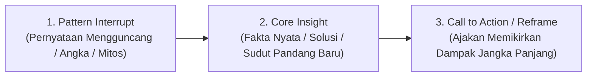

# Quick Reference Matrix — Hook Formula (MBG & Viral Short-Form)

Dokumen ini berisi panduan formula **Hook Matrix** (15 Tipe Hook, Formula & Contoh Implementasi MBG / Edukasi / Konten Viral) yang dapat digunakan sebagai referensi kurasi AI highlight reducer, copywriting judul klip, dan pembuatan script short-form video.

---

## 📊 Quick Reference Table (15 Tipe Hook)

| # | Tipe Hook | Sub-Kategori | Contoh Hook (MBG & Edukasi) | Target Emosi |
| :-: | :--- | :--- | :--- | :--- |
| **01** | **MYTH BUSTER** | Mitos yang Ternyata Salah | *"Katanya makan gratis pasti asal kenyang. Faktanya tiap porsi MBG dirancang ahli gizi — **protein, sayur, buah, semua dihitung**."* | Tercerahkan, Kaget |
| **02** | **DATA SPEAKS** | Angka yang Bikin Sadar | *"**8,3 miliar porsi** udah masuk ke perut anak Indonesia sejak program ini jalan — dan angkanya nambah tiap hari."* | Kagum, Sadar |
| **03** | **HIDDEN RIGHT** | Hak yang Kamu Nggak Tahu | *"Bukan cuma anak sekolah. **Ibu hamil, menyusui, sampai balita** juga berhak MBG — banyak yang belum tahu."* | Lega, Berdaya |
| **04** | **SILENT RISK** | Bahaya yang Diam-Diam | *"Anak ke sekolah tanpa sarapan bukan cuma lapar — konsentrasi drop, tumbuh kembang kena. **Itu yang dicegah satu piring MBG**."* | Waspada, Peduli |
| **05** | **SPEED PROOF** | Ternyata Secepat Ini | *"Dari nol jadi **29 ribu dapur dalam setahun**. Program sebesar ini biasanya makan waktu bertahun-tahun."* | Kaget Positif, Kagum |
| **06** | **LOCAL HERO** | Dari Titik Kecil, Prestasi Besar | *"Dapur kecil di desa sekarang masak ribuan porsi tiap hari, ambil sayur dari petani sebelah. **Satu dapur, satu ekonomi desa muter**."* | Bangga, Terinspirasi |
| **07** | **LITTLE-KNOWN** | Yang Jarang Orang Tahu | *"Di balik MBG ada **hampir 60 ribu UMKM** dan ribuan koperasi desa jadi pemasok. Ini bukan cuma program makan — ini mesin ekonomi rakyat."* | Tercerahkan, Penasaran |
| **08** | **PLOT TWIST** | Ternyata Kebalikannya | *"Kirain MBG cuma soal ngasih makan. Ternyata targetnya jangka panjang: **turunin stunting, siapin generasi 2045**."* | Kaget, Paham |
| **09** | **HONEST TALK** | Pengakuan yang Jujur | *"Program sebesar ini nggak mungkin mulus 100%. Pas ada laporan soal kualitas makanan, jawabannya bukan ditutupi — **SOP dapur langsung diperketat**."* | Percaya, Relate |
| **10** | **NOT YOUR FAULT** | Bukan Kamu yang Salah | *"Sekolahmu belum kebagian MBG? Bukan dilupakan. Ini lagi tahap perluasan **dari 63 juta menuju 82 juta penerima** — daerahmu masuk antrean."* | Lega, Terbantu |
| **11** | **STEP BY STEP** | Semudah Ini Ternyata | *"Punya UMKM atau koperasi desa? Kamu bisa **jadi pemasok bahan baku MBG**. Ini langkah gabung ke rantai pasoknya."* | Terbantu, Berdaya |
| **12** | **SURPRISING LINK** | Perbandingan Tak Terduga | *"Satu piring MBG harganya **nggak sampai segelas kopi kekinian**. Tapi dampaknya ke masa depan satu anak? Nggak ada tandingannya."* | Paham, Reframe |
| **13** | **NEAR FUTURE** | Masa Depan yang Dekat | *"Tahun ini target MBG naik ke **82,9 juta penerima** dan sekitar 21 miliar porsi — sebentar lagi hampir tiap anak sekolah dapat makan bergizi tiap hari."* | Harapan, Antusias |
| **14** | **ARE YOU IN?** | Kamu Termasuk Nggak? | *"Punya balita, lagi hamil, atau menyusui? **Kamu termasuk yang berhak MBG** — cek ke posyandu atau puskesmas terdekat."* | Relevan, Sadar |
| **15** | **RIPPLE EFFECT** | Efek Berantai dari 1 Aksi | *"1 anak makan bergizi hari ini = 1 anak lebih fokus, lebih jarang sakit, lebih siap bersaing 10 tahun lagi. **Kalikan 63 juta**."* | Termotivasi, Berdaya |

---

## 🧠 Struktur Formula & Penerapan pada Video Klip

Setiap hook di atas dibangun dengan pola struktur 3 detik pertama (*First 3-Second Retention Rule*):

### 1. **Pola Kognitif (Pattern Interrupt)**
- **Mitos vs Fakta**: Menghancurkan prasangka audiens di 1 detik pertama (`"Katanya X, padahal Y..."`).
- **Angka Dramatis**: Menyoroti skala angka raksasa yang belum pernah didengar (`"8,3 miliar porsi...", "29 ribu dapur..."`).
- **Relatability**: Mengaitkan dengan kehidupan sehari-hari (`"Bukan kamu yang salah...", "Satu gelas kopi kekinian vs satu piring MBG"`).

### 2. **Integrasi ke xClips AI Prompt & Highlight Ranking**
Formula ini dapat diintegrasikan ke dalam sistem AI prompt xClips (`src/lib/xclips/transcript-chunker.ts`) saat memfilter dan memberi bobot skor viralitas transkrip video podcast / presentasi.
